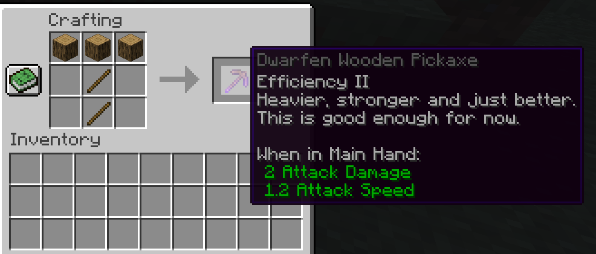

# Some Factions MC-Plugin

This Plugin provides 4 factions in total, which all have unique traits and features.
You can choose your faction with the `/faction join` command.
Choose wisely, since you can't change it later on.

## The Factions
### Humans
Humans gain the `Hero of the Village` and `Strength I` effect.
Their main goal is it to trade with Villagers to get their items.
They also can ride horses faster, which is their best option for travelling long distances.

### Dwarfs
Dwarfs gain `Haste I` and `Resistence I` effects.
They gain more ores from mining and can also craft special pickaxes as shown below.
For travelling, they can use faster Minecarts, since they can walk a little slower.

### Elbs
Elbs are the only Faction which can use the Crafting Table.
They walk and run faster and can jump higher.

### Oceanic
Lastly there is an Ocean faction, which has the Effects `Dolpins-Grace`, `Conduit-Power` and `Luck`.
So they can swim faster, breath underwater and get better Items from fishing.
They can also craft two Trident Versions.
The recipes are as follows:

----

## Planed features and upcoming changes
Ork
 - Schaden im Hellen
 - werden nicht von Zombies angegriffen
 - bad Omen
 - langsamer Hunger verlieren
 - Feuerresistenz (im Nether?)
 - Speed (im Nether)

Orks im Nether stark <-> Elben in der Oberwelt 